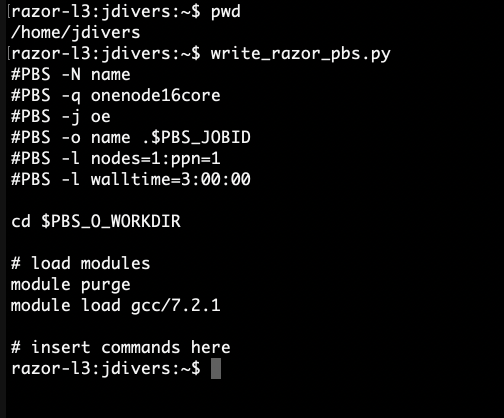

# BIOL5153
This repository is for files pertaining to BIOL 5153 Programming for Biologists.

assn03 &nbsp;&nbsp;&nbsp;&nbsp;&nbsp;&nbsp;&nbsp;&nbsp;&nbsp;&nbsp;&nbsp;&nbsp;&nbsp;&nbsp;&nbsp;&nbsp;&nbsp;&nbsp;&nbsp;&nbsp;&nbsp;&nbsp;&nbsp;&nbsp;&nbsp;&nbsp;&nbsp;&nbsp;&nbsp;&nbsp;&nbsp;&nbsp;&nbsp;&nbsp;&nbsp;&nbsp;&nbsp; -- taped and zipped file containing output files for submission for hw assignment 03

**scripts/**&nbsp;&nbsp;&nbsp;&nbsp;&nbsp;&nbsp;&nbsp;&nbsp;&nbsp;&nbsp;&nbsp;&nbsp;&nbsp;&nbsp;&nbsp;&nbsp;&nbsp;&nbsp;&nbsp;&nbsp;&nbsp;&nbsp;&nbsp;&nbsp;&nbsp;&nbsp;&nbsp;&nbsp;&nbsp;&nbsp;&nbsp;&nbsp;&nbsp;&nbsp;&nbsp;&nbsp;&nbsp&nbsp;-- directory of automation scripts  
&nbsp;&nbsp;&nbsp;&nbsp;&nbsp;nucleotide_compostion.py&nbsp; -- script for automating analysis of nucleotide composition from DNA sequence (default: Watermelon nad4L seq)

write_razor_pbs.py&nbsp;&nbsp;&nbsp;&nbsp;&nbsp;&nbsp;&nbsp;&nbsp;&nbsp;&nbsp;&nbsp;&nbsp;&nbsp;&nbsp;&nbsp;&nbsp;&nbsp;&nbsp;&nbsp; -- python script to automate pbs job scripts for AHPCC Razor cluster (see image) (this is a temporary duplicate; permanent version in scripts dir)

write_pinnacle_slurm.py&nbsp;&nbsp;&nbsp;&nbsp;&nbsp;&nbsp;&nbsp;&nbsp;&nbsp;&nbsp; -- python script to automate slurm job scripts for AHPCC Pinnacle cluster (this is a temporary duplicate; permanent version in scripts dir)

Screenshot of write_razor_pbs.py run on Razor AHPCCluster

